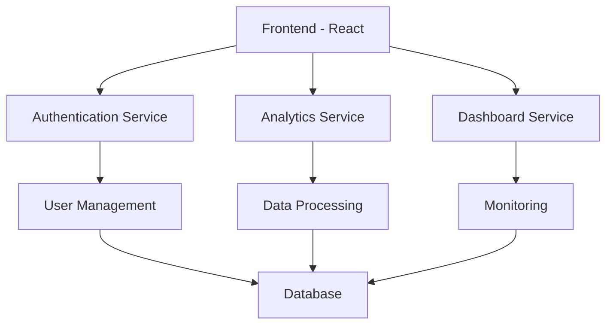
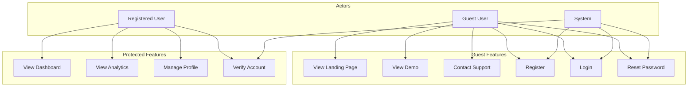

# OBAM AI - LLM Observability Platform

## Overview
OBAM AI is a powerful LLM observability platform that provides complete visibility into AI applications. It enables monitoring, tracking, and optimization of LLM systems.

## System Architecture


## Use Case Diagram


## Features
- 🔐 Secure Authentication System
- 📊 Real-time Analytics Dashboard
- 📈 LLM Performance Monitoring
- 👤 User Profile Management
- 📱 Responsive Design
- 🔄 Real-time Data Updates

## Tech Stack
- Frontend: React.js
- Styling: Tailwind CSS
- Authentication: Custom Auth System
- State Management: React Context
- Routing: React Router
- Build Tool: Vite

## Getting Started

### Prerequisites
- Node.js (v14 or higher)
- npm or yarn

### Installation
1. Clone the repository
```bash
git clone [repository-url]
```

2. Install dependencies
```bash
npm install
```

3. Start development server
```bash
npm run dev
```

## Project Structure
```
src/
├── assets/        # Static assets
├── components/    # Reusable components
├── context/       # React context providers
├── Graphs/        # Data visualization components
├── pages/         # Page components
├── services/      # API services
└── App.jsx        # Main application component
```

## License
This project is licensed under the MIT License - see the LICENSE file for details.

## Contact
For support or inquiries, please visit our contact page or reach out to our support team.
